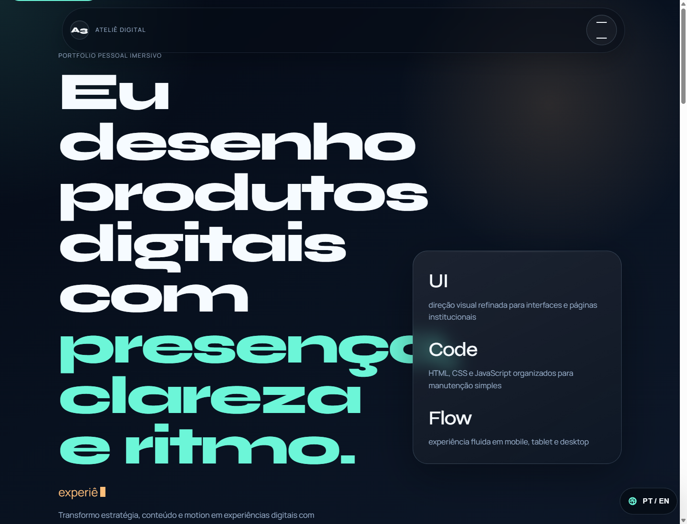
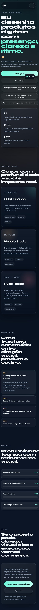

# Ateliê Digital | Portfólio Imersivo

Site estático de apresentação com direção visual premium, navegação fluida e foco em portfólio institucional. O projeto foi desenvolvido com HTML, CSS e JavaScript puro, sem dependência de framework ou etapa de build.

## Preview

### Desktop



### Mobile



## Sobre o Projeto

Este projeto foi pensado como uma vitrine visual para apresentar trabalhos, capacidades e contato de forma elegante, responsiva e memorável. A proposta é demonstrar qualidade de interface, cuidado com microinterações, hierarquia tipográfica e organização de um front-end estático pronto para publicação.

O conteúdo público foi mantido com informações institucionais genéricas, sem nomes de pessoas e sem dados pessoais reais.

## Objetivo

- Apresentar um site de portfólio com identidade visual forte e acabamento profissional.
- Demonstrar domínio de HTML semântico, CSS moderno e JavaScript vanilla.
- Entregar uma base simples de manter e adequada para deploy estático na Vercel.

## Tecnologias Utilizadas

- HTML5
- CSS3
- JavaScript Vanilla
- Google Fonts (`Manrope` e `Syne`)
- Google Translate Inline carregado sob demanda

## Funcionalidades

- Hero section com tipografia marcante e efeito typewriter.
- Navegação em overlay com abertura por botão e fechamento com `Esc`.
- Cards de projeto com tilt 3D em dispositivos com ponteiro fino.
- Timeline expansível com foco em leitura e organização.
- Barras de habilidades animadas com `IntersectionObserver`.
- Botão para copiar o e-mail institucional com feedback visual.
- Botão flutuante de tradução `PT / EN` com lazy load do Google Translate.
- Layout responsivo para desktop, tablet e mobile.
- Respeito a `prefers-reduced-motion`.

## Estrutura de Pastas

```text
site-3-portfolio/
├── assets/
│   ├── css/
│   │   └── styles.css
│   └── js/
│       └── main.js
├── docs/
│   └── preview/
│       ├── desktop-home.png
│       └── mobile-home.png
├── index.html
├── README.md
└── .gitignore
```

## Como Clonar o Repositório

```bash
git clone URL_DO_REPOSITORIO
cd site-3-portfolio
```

## Como Instalar Dependências

Este projeto não possui dependências de `npm` e não exige instalação de pacotes para rodar localmente.

## Como Rodar Localmente

Você pode abrir o `index.html` diretamente no navegador, mas a forma mais recomendada é subir um servidor estático local:

```bash
python -m http.server 5500
```

Depois, acesse:

```text
http://127.0.0.1:5500
```

Para encerrar o servidor:

```bash
Ctrl + C
```

## Build de Produção

Não existe etapa de build neste projeto. Como se trata de um site estático, os arquivos podem ser publicados diretamente.

## Visualização no Navegador

- Desktop: testar larguras amplas para validar composição, espaçamento e navegação.
- Tablet: conferir empilhamento das seções e leitura dos cards.
- Mobile: validar botões em largura total, menu, timeline e FAB de tradução.

## Deploy na Vercel

Como o projeto é estático, o deploy na Vercel é simples:

1. Importe o repositório na Vercel.
2. Selecione o tipo de projeto estático.
3. Mantenha o diretório raiz como `./`.
4. Não preencha comando de build, se a configuração pedir explicitamente.
5. Publique o projeto.

## Validação Recomendada

Para uma checagem técnica rápida:

```bash
node --check assets/js/main.js
```

Depois disso, revise o site no navegador em mais de um breakpoint.

## Melhorias Futuras

- Substituir os cases demonstrativos por projetos reais com links externos.
- Adicionar imagem social dedicada para `og:image`.
- Incluir favicon e imagens institucionais em `assets/images/`.
- Criar variação com modo claro, se fizer sentido para a identidade final.
- Adicionar analytics e formulário de contato real quando o site estiver em produção.

## Autor / Créditos

Projeto preparado como peça de apresentação pública, com conteúdo institucional genérico e sem dados pessoais.

## Licença

Este repositório não possui uma licença definida até o momento.
